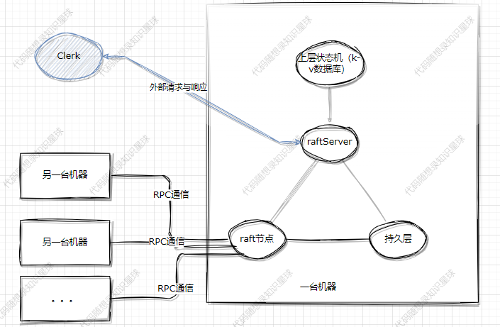

# KVstorageBaseRaft-cpp
> notice：本项目的目的是学习Raft的原理，实现一个简单的分布式k-v存储数据库。
## 第三方依赖
- boost， 
- muduo
- protoc
**安装说明**
- protoc，本地版本为3.12.4，ubuntu22使用`sudo apt install protobuf-compiler libprotobuf-dev`安装默认就是这个版本
- boost，`sudo apt-get install libboost-dev libboost-test-dev libboost-all-dev`
- muduo,https://blog.csdn.net/QIANGWEIYUAN/article/details/89023980

## 编译
```bash
cd build/ && rm -rf *
cmake .. && make -j8
```
## 运行
```bash
cd bin/

#启动raft集群
./raftCoreRun -n 3 -f test.conf
#启动客户端
./callerMain
```

## 项目介绍

## 跳表讲解
什么是跳表?
跳表是一种概率性数据结构，基于多层有序链表，每一层都是下一层的一个子集。最底层是原始数据的完整列表，每个元素在上面一层出现的概率是一样的(一般取1/2)
举例：我们从原链表中选一些关键节点出来作为索引层，这样就形成了2层链表，即跳表。举个例子：假设有6个节点，查k=6节点要从头遍历到尾。在跳表表中则不一样了，假设我们取1，3，5三个节点作为索引层。查询先查1<6，直接跳到k=3<6,再跳到k=5<6，但到头了，跳到下一层，查找中我们跳过了k=2和4。
然后我们再保证每2层之间的的节点比是2:1，就能保证logn的查询

记住：只有最底层是真正的数据层，上面的索引层都是数据在维护。

跳表层级如何确定：随机确定
理想情况下，我们希望每隔一个节点就选一个作为上层索引，保证logn的查询
就是说我们希望每个节点都有50%的概率被选到第2层，有25%的概率被选到第3层(50%*50%)，实现这个就很简单了：rand()得到随机数，奇数加一层，偶数就停，确定层级。这种方法的原理叫大数定律，当进行足够多的实验，某个事件发生的概率会接近理论概率。

跳表的结构：
跳表节点的数据结构：key, value, 层级，前向指针(2级指针，就是一个指针数组，p[i]本结点在第i层的下一个节点地址)
跳表类：最大层级、当前层级、虚拟头节点、节点数量
跳表的搜索过程：从顶层开始比较，小于目标节点则向右遍历，大于或着遍历到头了，就下沉移动到下一层，继续查找
插入：1、从最高层开始逐层确定插入位置，每层找到一个最接近但比它小的节点，记下它的位置，因为后续可能要更新这个节点next指针。
       2、随机确定层级，若层级高于当前跳表的最高层级，那所有的更高层级，虚拟头节点就作为前驱节点；剩下就是在各层插入新节点，同时更新前节点的next指针。 至此，节点插入到跳表，且跳表的索引层也全部更新。
删除：删除与插入同理

为什么zset使用跳表不用平衡树(红黑树、AVL树)？
1. 跳表实现要更简单；
2. 跳表扩展更容易，添加层级更新指针即可，不需要重平衡操作；
3. 并发比平衡树更友好，平衡树增删节点后需要旋转进行重平衡，往往加的锁粒度都比较大，比如说全局锁。而跳表要增删节点只需要对该节点所在的那些层的相邻节点给加锁，即可。锁的粒度小。
以上是跳表的优点，而zset作为一个有序集合，典型应用场景是排行榜，对并发要求比较高。所以他选择跳表，可以更简单更高效支持并发操作。

那为什么mysql不用跳表用B+树呢？
数据量的问题：b+树优势在于低层级存大量数据，3层可能就能干到千万，换成跳表层级太高磁盘io次数太多。


## raft讲解
参考视频链接：https://www.bilibili.com/video/BV1WN411c7xh/?p=4&spm_id_from=pageDriver
文档：docs/raft

CAP理论
1. 一致性：所有分布式的数据在任何时候都要保持一致。一致性可能会导致系统不可用
2. 可用性：系统中所有正常的节点收到请求后必须给出响应，保证系统对外是可用的。
3. 分区容错性：分区是指分布式系统节点间通信出现问题，我们就称出现了分区。分区容错性就是说即使出现分区，集群依旧要正常运行。
4. 一般都是3选2,而p几乎是必选，所以基本上分布式系统要么是AP模型，要么是CP模型。这2种模型的意思是在分布式系统出现问题时，你是优先保证一致性，还是优先保证可用性。如：银行流水，必须是AP， 而会员昵称可以是CP。
5. 但是要注意：并不是说保证了一致性，可用性就是完全不可用，只是需要权衡的时候你优先选择保证那一边。
6. raft算法就是要保证它的CAP，使得系统在任何情况下都能够对外提供一致的数据；且部分节点故障下，依旧能提供服务；分区恢复后，能够自动合并数据一致性。

状态机：Raft的上层应用，可是任意存储层，本项目是KV数据库
Term: 任期，是Raft集群内部的逻辑时钟；
日志：一条执行命令，类似redis的AOF日志。raft算法的⽬的：保证各节点⽇志⼀致->上层状态机执⾏的命令⼀致->上层状态机数据⼀致。

什么是raft,基本原理？
Raft算法是一种分布式算法，旨在保证分布式系统中的数据一致性。
他把系统中的节点分为三类角色：追随者（接受leader的⼼跳和⽇志同步请求，投票给候选人）和候选人（选举过程中的临时角色，参与竞选leader）、leader领导者(统领整个集群，负责处理客户端请求、更新数据到其他节点)。
Raft算法的基本原理包括以下几点：
1. 领导者选举（Leader Election）：在系统启动时或者当前领导者失效时，节点会发起选举过程。节点会在一个随机的超时时间内等待收到来自其他节点的心跳消息。如果在超时时间内没有收到心跳消息，节点就会成为候选人并发起选举。候选人向其他节点发送投票请求，并在得到大多数节点的投票后成为新的领导者。
2. 日志复制（Log Replication）：一旦领导者选举完成，新的领导者就会接收客户端的请求，并将更新的日志条目复制到其他节点。当大多数节点都成功复制了这些日志条目时，更新被认为是提交的，并且可以应用到节点的状态机中。
3. 安全性（Safety）：Raft算法保证集群最多只有一个leader(即使出现分区)、而且leader的日志条数一定比一半以上的要多或者相等。这样就保证了数据的安全性。


选举过程：
举例说明：
1. 假设现在有5个节点，开始大家都是追随者，每个节点raft都会设置一个随机超时时间，时间内未收到leader心跳就发起选举。
2. 现在节点1先超时，他就把自己的term+1,身份变为候选人，给自己投一票，并向其他节点发起RPC拉票请求。由于集群目前只有一个候选人，且term大，所以其他4个节点把票投给节点1，把term更新为节点1的term。节点1收到超过半数的票，就成为leader，定时发送心跳给其他节点。
3. 当节点1挂了，其他4个节点时间内未收到心跳，则又会发起选举，步骤与之前一样。
4. 出现投票分裂：假设节点1还是宕机的，节点2和节点3同时超时，出现2个候选人，最终节点4投给节点2，节点5投给节点3，现在2，3节点都是2票，未达到半数，就会继续向节点1拉票(因为他们不知道节点1宕机了)，这样下去很肯定是没结果。一段时间后，节点4也超时了，开始拉票，而且它的term肯定是最大的，所以2，3，5三个节点都会投票给他，成为leader,同时其他人身份恢复为追随者。
5. 追随者在收到拉票请求时不是无脑投票给他的，一看term，2看候选人与自己的日志新旧，看commit，若候选人的commit日志比我的还少，那它成为leader不是对数据产生危险了吗。
问题：
  为什么要获得半数以上的票才能当leader？为了保证只有一个leader。
     如果发现一个leader，但是其term小于自己会发生什么？发起新选举，且通知过时的leader。这种情况是可能出现的：网络分区。
随机超时时间的目的？防止同一时间出现太多的候选人导致无法选出leader。
超时时间怎么设置的？
每100ms发一次心跳，每300-500ms发起一次选举


日志复制过程：
1. 领导者接收到客户端的写请求后，将这些命令追加到自己的日志数组中，然后先跟其他节点发起一个日志追加的请求，把日志数组发给他们
2. 追随者收到请求后，开始同步日志，发回响应给leader；
3. 当leader发现有超过半数的节点完成同步某条日志的同步(假设是逐条复制)，则提交本条日志到上层状态机，在本项目中就是KV数据库。并且让其他节点也提交。至此一条日志就复制完了。
4. 过程中有一些细节，比如leader给每个节点发的日志数组都是不一样的，因为leader端有一个数组记录着每个节点同步到哪一条了，它根据这个数组有选择的发送日志过去，不然每次都发送全部日志，消耗太大了。而且raft算法也是有日志压缩机制，防止日志无限增长，即快照，类似redis的rdb快照，根据它的内部策略有时会直接发送快照进行同步。
5. 若出现分区，可能会导致有的节点日志不匹配，如何解决？先说结论：强leader一致性。如leader发了5条日志过来，从index=5位置从后往前匹配，第5条不匹配，第4条不匹配，第3条匹配，那说明123都是匹配的(因为日志的顺序一致性)，则把4567覆盖为leader的45。

快照：快照是某个瞬间的数据，而日志是一条条命令，通过快照来同步就是把数据直接应用到上层状态机：先要把状态机清空，然后把数据给读进去。快照的数据与raft没有任何关系，没有什么term,index
快照是怎么制作的？ 当日志数目达到一定的阈值，就打一个快照：跳表的所有数据用protobuf序列化成2进制也就是bin数据，并且落盘存着。
多久制作一个快照：每隔1000个日志条目我们生成新快照


Raft算法在实际场景中的应用有哪些？是否了解一些使用Raft的实际系统案例？
1. 一些常见的配置中心，为了保证可用会采用Raft，比如zookeeper的底层实现了基于Raft修改的算法，ETCD等。
2. 一些分布式数据库，比如TIKV，TiDB

Raft算法在分布式系统中有哪些常见的问题和挑战？
1. Leader节点负责所有的客户端请求的处理和日志复制，这可能会成为系统的瓶颈。（允许从追随者读）
2. 日志复制延迟：Raft算法要求日志复制必须在大多数节点上完成后才能提交，这可能导致日志复制的延迟，影响系统的实时性能。
3. 网络分区：网络分区恢复后数据的合并比较复杂。

Raft算法如何处理节点故障？
节点故障和网络分区是一个意思，都是节点间无法通信。
1. 小于半数的节点故障：若leader也挂了，集群就会重新选举，选出新leader恢复工作；若leader没挂，那集群正常对外提供服务，面对写请求，只要半数以上的通过完成同步即可。
2. 大于半数的节点故障：不管leader挂没挂，集群会对外停止服务。因为假设leader挂了，那剩余也选不出新leader，拿不到半数以上的票；若leader没挂，它完成不了半数以上节点的日志同步。


Raft与Paxos：与raft经常放在一起说的，只是有一点了解：
1. 多个节点合作完成数据一致性
2. 三个角色：提议者:提出值，并试图说服大多数接受者；接受者：接收提议者的建议，并决定是否接受；学习者：记录已被接收的提议。
3. 操作流程：
  1. 准备阶段：提议者向大多数接受发起准备请求，会带上一个提案编号；接收者收到后，判断若编号比之前收到的都大，则接受，且不在收比他小的编号，返回响应。
  2. 接受阶段：提议者根据准备阶段的响应，选择被接受的最大的提案编号对应的值，向大多数接受者发送接受请求。接收者还是比较一下编号，接受提案，并告知学习者，让他传播。

——————————————————————————————————————————————————————————
代码：
Raft层
1. 看raft类的成员和函数声明，重点是成员变量，函数都是给他们服务的
   init函数：启动三个定时器线程分别维护：选举、日志同步和心跳、raft与上层状态机之间的联系。
  超时时间每次选300-500的随机值, 发送心跳间隔：100ms
  （1）leaderHearBeatTicker()：选举定时器，raft类有一个成员：m_lastResetElectionTime(记录上一次收到心跳的时间点)，我们这个线程就定期去检查这个变量，睡眠时间就设为超时时间，醒来后若发现变量没变，则说明一个超时时间内没收到心跳，那就发起选举。若变量变化了，就继续睡。
       doElection()：term+1,给自己投一票，向其他节点发起RPC拉票请求，把自己的term,日志的index都发过去，追随者节点收到后比较一下        term和日志，选择是否投票给他。
     （2）leaderHearBeatTicker:维护日志复制、和心跳(因为日志复制其实也是一个心跳)，定时向其他节点发送日志复制或心跳，日志复制这里是2条路：是发送快照还是发送日志条目，怎么选？如你要向1节点发起同步请求，但你一看1节点需要的日志已经被打进快照，那就发快照，不发日志了。若没有打进快照，就查日志同步数组，发日志给他。追随者收到后比较一下term和日志新旧，选择是否同步。
（3）applierTicker() ；定期把commit了的日志应用到上层状态机里，并根据日志数判断是否要打快照


持久化层
哪些数据需要持久化？ 
     kvdb的快照、日志数组(他俩加一起就是所有的日志了)，term, m_votedFor(投票情况)
   什么时候持久化：当要持久化的内容发生改变的时候如term等。
谁来调用持久化？谁调都行，这里就用raft自己来调

KVserver层
面试的时候别说，知道就行



客户端：
clinet需要与leader节点建立联系：
1. 可以随意向某个节点发起请求，然后让他转发给leader
2. 把leader注册进zk。